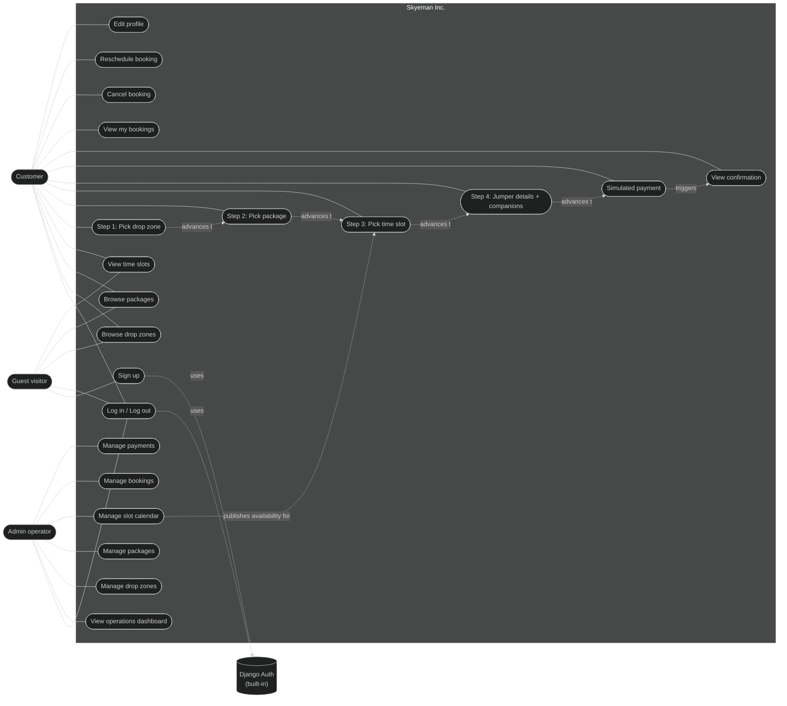

# 2. Use Case Diagram — Skyeman Inc.

> A *use case diagram* shows the **actors** (people or systems that interact with the app) and the **use cases** (things the system can do). Lines connect actors to the use cases they participate in.

> Skyeman has a single instructor — **Femi**. There is no `Instructor` model,
> no admin screen for instructors, and no UI surfacing an instructor picker.
> Every slot is run by Femi by default.

---

## 2.1 Diagram

---

## 2.2 Actors

| Actor | Description |
|---|---|
| **Guest visitor** | An unauthenticated browser. Can browse, sign up, and log in. |
| **Customer** | An authenticated end-user. Browses, books, pays (simulated), manages own bookings. |
| **Admin operator** | A staff/superuser. Operates the business through the Django admin **and** the `/manage/` operations console. |
| **Django Auth** | The built-in authentication system used by sign-up and log-in flows. |

---

## 2.3 Use case descriptions

### UC-1: Sign up
- **Actor:** Guest visitor
- **Preconditions:** None.
- **Main flow:**
  1. Guest visits `/accounts/signup/`.
  2. Enters username, first/last name, email, and password.
  3. System creates a User record and logs them in.
  4. System redirects to the dashboard.
- **Postconditions:** A new `User` exists. The session is authenticated.
- **Alternative flows:** Username taken / weak password → form re-renders with errors.

### UC-2: Log in / Log out
- **Actor:** Guest, Customer, Admin
- **Preconditions:** None for log in. Logged-in session for log out.
- **Main flow:** Standard Django auth — POST credentials → session created → redirect. POST to `/accounts/logout/` → session cleared → redirect home.
- **Postconditions:** Session state reflects the change.

### UC-6 → UC-9: 4-step booking wizard
- **Actor:** Customer
- **Preconditions:** Logged in. (No slots have to be open yet — the wizard lets you see the empty state.)
- **Main flow:**
  1. **Step 1 — `/bookings/book/step-1/`:** customer picks one of the seeded drop zones (radio cards).
  2. **Step 2 — `/bookings/book/step-2/?dropzone=X`:** customer picks a jump package. Eligibility rules (`min_age`, `max_weight_kg`) are surfaced on the card.
  3. **Step 3 — `/bookings/book/step-3/?dropzone=X&package=Y`:** customer picks an open, future time slot at that drop zone. Each slot shows seats left.
  4. **Step 4 — `/bookings/book/step-4/?dropzone=X&package=Y&slot=Z`:** customer enters their age, weight, group size, and (if `group_size > 1`) name + age for each companion.
  5. On submit, `BookingDetailsForm.clean()` re-checks slot capacity, package age/weight eligibility, group-size rules, and validates every companion row.
  6. A `Booking` is created (status=`pending`), a `BookingParticipant` is created for the lead jumper, and one per companion.
  7. Customer is redirected to the simulated payment page.
- **Postconditions:** A `pending` `Booking` exists with linked participants. `TimeSlot.seats_left` decremented by `group_size`.

### UC-10: Simulated payment
- **Actor:** Customer
- **Preconditions:** A `pending` booking owned by the customer.
- **Main flow:** Customer picks a method (card / paypal) → submits → a `Payment` is upserted with `status='paid'` and `paid_at=now()`, and the `Booking` is moved to `confirmed`. `TimeSlot.update_status()` runs to flip `status='full'` if capacity is now reached.
- **Postconditions:** `Booking.status == 'confirmed'`, `Payment.status == 'paid'`.
- **Note:** This is a university project. No real money is ever charged.

### UC-12: View my bookings
- **Actor:** Customer
- **Preconditions:** Logged in.
- **Main flow:** System returns all bookings where `user == request.user`, ordered by `created_at` desc.
- **Postconditions:** None (read-only).

### UC-13: Cancel booking
- **Actor:** Customer
- **Preconditions:** Booking is owned by user. Slot is in the future. Booking is not already cancelled/completed.
- **Main flow:** Customer confirms → `Booking.status='cancelled'`. If a paid `Payment` exists, its status becomes `refunded`. `TimeSlot.update_status()` is called.

### UC-14: Reschedule booking
- **Actor:** Customer
- **Preconditions:** Same as cancel.
- **Main flow:** Customer picks a different `open` slot at any drop zone. System swaps `Booking.time_slot`. Both old and new slots have `update_status()` called.

### UC-16: View operations dashboard
- **Actor:** Admin operator
- **Preconditions:** Logged in to `/manage/`.
- **Main flow:** Returns 8 KPI tiles (today's bookings, next 7 days, pending, cancellations last 30d, 30-day revenue, total users, total drop zones, open slots this week), plus recent bookings, upcoming slots, and recent payments.

### UC-17 / UC-18 / UC-20 / UC-21: Manage entities (Django admin)
- **Actor:** Admin operator
- **Standard Django admin CRUD** — with `list_display`, `list_filter`, `search_fields`, and inline time-slot editing on the drop zone page.

### UC-19: Manage slot calendar (`/manage/slots/`)
- **Actor:** Admin operator
- **Preconditions:** Logged in to `/manage/`.
- **Main flow:**
  1. `/manage/slots/` lists every slot grouped by date, with filter chips for status and a zone filter.
  2. `/manage/slots/new/` is a quick-create form (drop zone, date, start time, capacity).
  3. Each row has one-click buttons: `Open` / `Mark full` / `Cancel (weather)` / `Delete` (only when zero bookings).
- **Postconditions:** Slot availability changes are immediately visible to the customer wizard.
