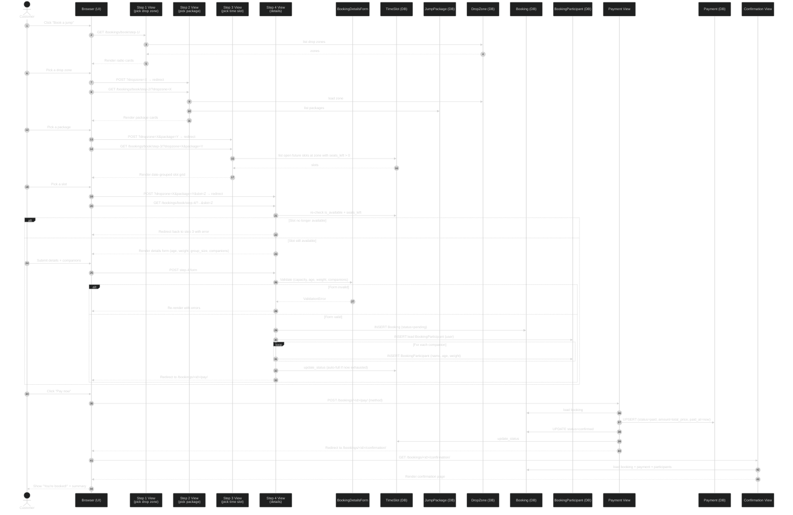
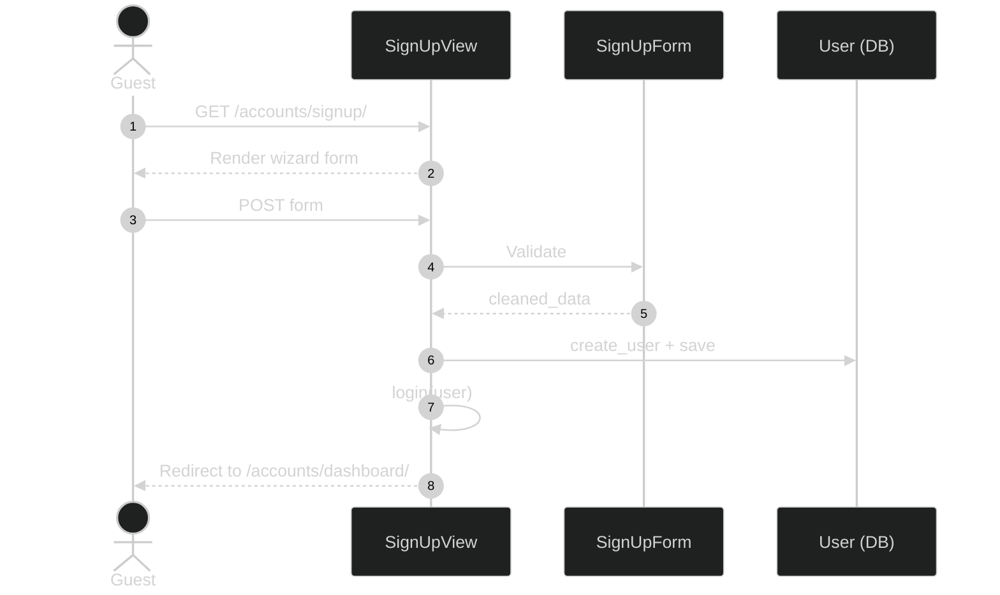
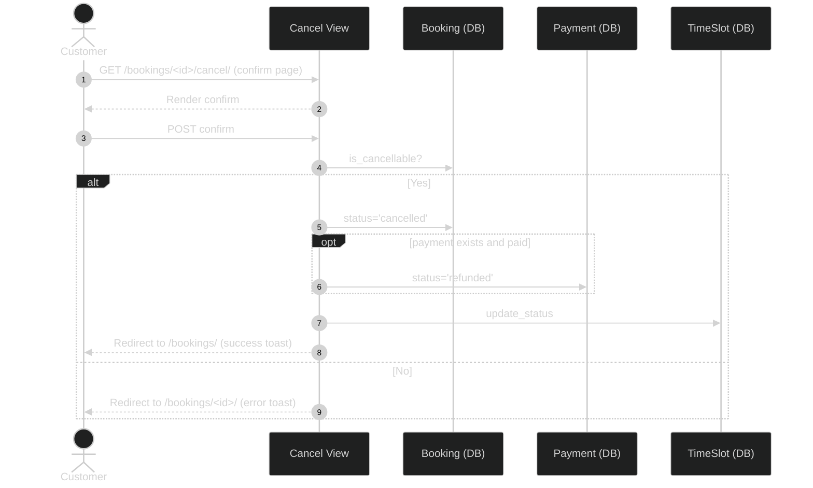
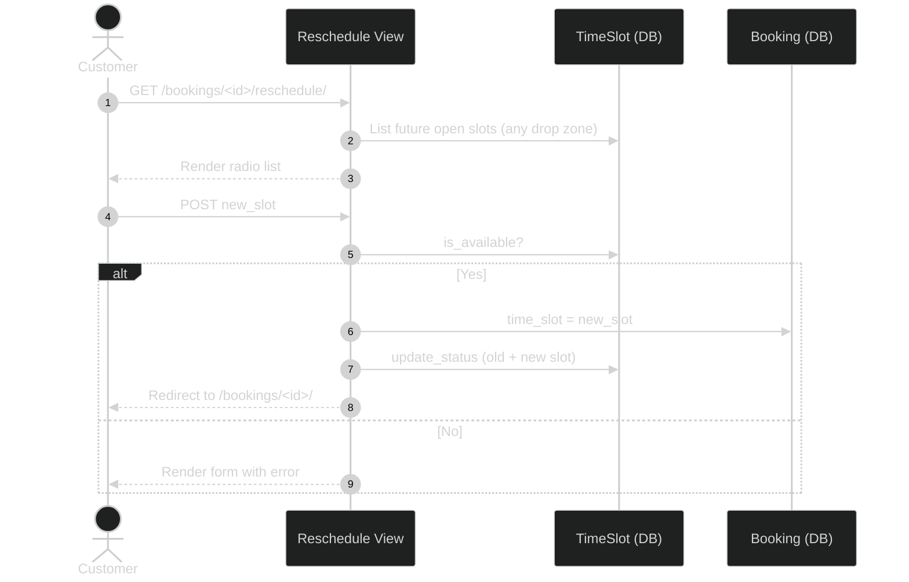
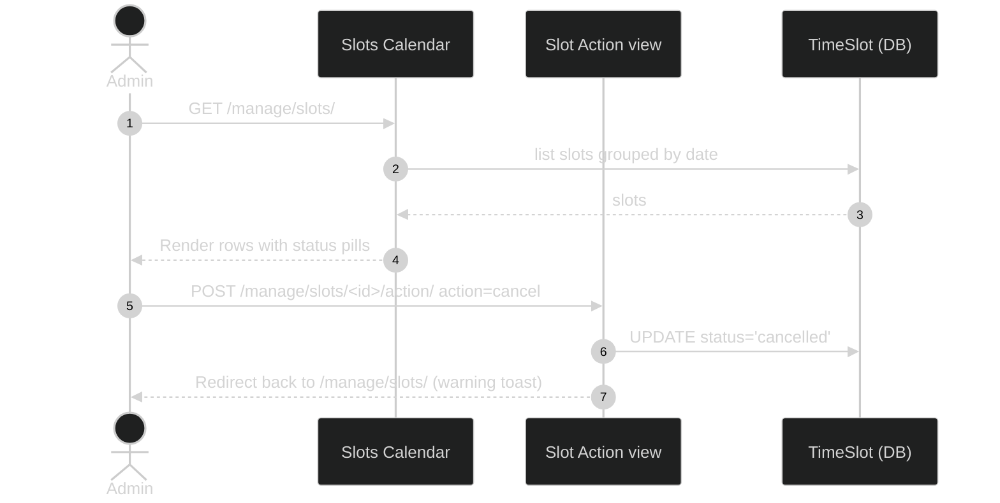
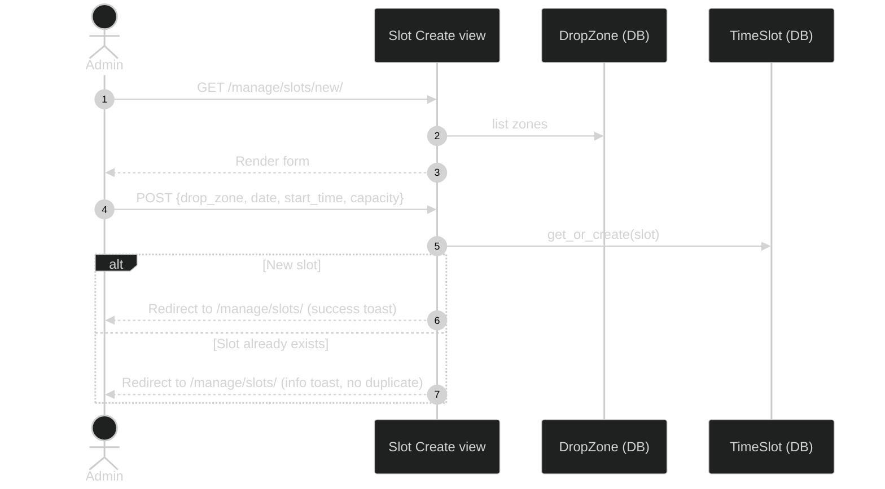

# 3. Sequence Diagram — Skyeman Inc.

> A *sequence diagram* shows the order of messages exchanged between objects (or actors + system components) to carry out a use case. Time flows top → bottom.

The most important flow in the system is **booking a slot + simulated payment**,
which is now a 4-step wizard, so the diagram below focuses on that. Shorter flows
(sign-up, cancel, reschedule, admin slot calendar) are summarised at the end.

> Skyeman has a single instructor — Femi. There is no `Instructor` entity in
> any of these flows; the customer's wizard never asks "which instructor?"

---

## 3.1 Booking wizard + simulated payment

---

## 3.2 Step-by-step description

1. **Customer clicks "Book a jump."** Browser sends `GET /bookings/book/step-1/`. The view loads the seeded drop zones and renders them as radio cards.
2. **Step 1 submit.** Customer picks a drop zone. View returns a 302 to `/bookings/book/step-2/?dropzone=X`.
3. **Step 2 — pick package.** Customer picks a `JumpPackage`. View returns a 302 to step 3 with both query params.
4. **Step 3 — pick time slot.** View lists future `TimeSlot`s at the chosen drop zone with `status='open'` and `seats_left > 0`, grouped by date.
5. **Step 4 — jumper details.** View re-checks the slot's availability (a slot could have been booked out by another user mid-wizard). If still available, it renders the form with hidden companion rows (rendered server-side from `BookingDetailsForm.companion_forms`).
6. **Step 4 submit.** `BookingDetailsForm.clean()` enforces:
   - `slot.seats_left >= group_size`
   - `jumper_age >= package.min_age`
   - `jumper_weight_kg <= package.max_weight_kg`
   - `package.name == "Group"` ⇒ `group_size >= 2`
   - every companion row valid (name + age 16-100)
7. **Booking + participants are inserted** as one atomic transaction. Lead jumper is created from `request.user`. Each companion becomes a `BookingParticipant`.
8. **Slot auto-flips to `full`** via `TimeSlot.update_status()` if its `booked_count` now reaches `capacity`.
9. **Customer redirected** to `/bookings/<id>/pay/`.
10. **Payment.** `PaymentForm` is shown. On submit, `Payment` is upserted with `status='paid'`, `Booking.status='confirmed'`, and `TimeSlot.update_status()` runs again.
11. **Confirmation page** renders a summary card and acts as the stand-in for a confirmation email.
12. **The new booking** is also visible on `/bookings/` (My Bookings) and on the operations dashboard if the customer is staff.

---

## 3.3 Shorter flows

### 3.3.1 Sign up

### 3.3.2 Cancel booking

### 3.3.3 Reschedule booking

### 3.3.4 Admin slot calendar — one-click cancel (weather)

### 3.3.5 Admin creates a new slot

---

## 3.4 Why this design

- **Eligibility lives in the form** (`BookingDetailsForm.clean()`) so error messages are user-friendly and grouped.
- **Capacity is re-checked at step-4 entry and at save time**, so two concurrent users can't both grab the last seat(s).
- **State via URL query params** (`?dropzone=X&package=Y&slot=Z`) keeps the wizard stateless — refreshing a step doesn't lose progress, and the URL can be shared.
- **Payment is a separate view** so the booking can be created in `pending` state, which mirrors real-world flows.
- **Confirmation page replaces an email** to keep the assignment self-contained.
- **`TimeSlot.update_status()` is called at every booking/cancel/reschedule** so the slot's `status` stays in sync with `booked_count` without polling.
